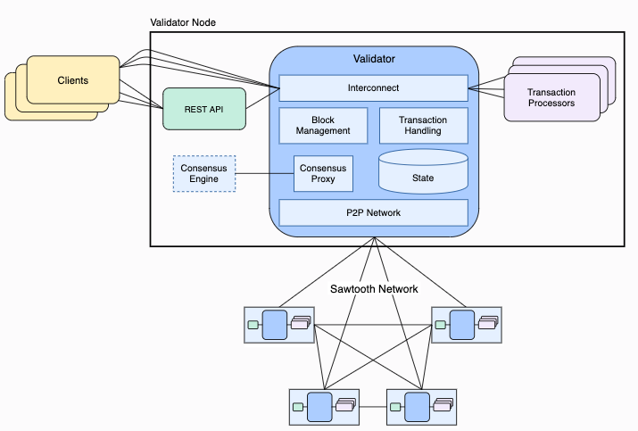

## 简述
[Hyperledger Sawtooth](https://cn.hyperledger.org/projects/sawtooth)是由Hyperledger和Intel共同孵化的一个企业级区块链平台。它有如下特点：

1. 应用开发与核心系统分离：能够更简单的开发以及发布区块链应用。
2. 权限控制：可以定制不同角色、身份以及权限。
3. 并行交易执行：提升交易处理速度。
4. 事件系统：支持默认的事件以及应用自定义事件，更好的帮助区块链应用开发。
5. 兼容以太坊Solidity智能合约。
6. 动态共识算法：支持PoET、PBFT、PoET Sim、Raft等共识协议。

相比Hyperledger Fabric，它在环境的搭建以及维护上会简单许多。同时，开发区块链应用也比Fabric容易。

## 架构简述
Sawtooth架构图如下：

它包含了如下几大模块：

1. Validator：用于验证交易、打包区块，管理共识等。
2. Transaction Processor（TP）：验证和执行交易，并更新账本状态（Global State），可以把它理解成智能合约。
3. Rest API：用于客户端和Sawtooth网络交互。
4. Consensus Engine: 共识协议模块，支持PoET、PBFT以及Raft等。
5. Clients: 客户端程序，向Sawtooth网络发起交易。

## 应用开发
对于Sawtooth应用开发，我们仅需要关注Transaction Processor和Clients即可。Sawtooth提供多种语言的SDK来帮助我们开发TP以及Client端程序。支持的语言有：Rust、Go、Java、JS和Python等。本文将会通过Go语言给大家讲述怎么开发一个简单的Sawtooth应用。

### 开发环境搭建
#### 1. Docker以及Docker Compose安装
本文不会过多阐述docker以及docker-compose的安装。若读者未安装它们，请参考如下链接：

* [Docker安装](https://docs.docker.com/docker-for-mac/install/)
* [Docker Compose安装](https://docs.docker.com/compose/install/)

#### 2. Go安装
同样，读者可以参考如下链接安装Go环境:

* [GVM Go version manager](https://github.com/moovweb/gvm)
* [Goenv](https://github.com/syndbg/goenv)

#### 3. Sawtooth网络启动
我们将使用docker-compose在本地启动一个开发环境下的Sawtooth网络。将如下docker-compose.yaml文件拷贝到本地，并使用**docker-compose up**命令启动网络。至于Sawtooth网络具体搭建的过程，后面会专门写文章来进行阐述。
```yaml 
# docker-compose.yaml
version: "2.1"

services:

  settings-tp:
    image: hyperledger/sawtooth-settings-tp:1.1
    container_name: sawtooth-settings-tp-default
    depends_on:
      - validator
    entrypoint: settings-tp -vv -C tcp://validator:4004

  validator:
    image: hyperledger/sawtooth-validator:1.1
    container_name: sawtooth-validator-default
    expose:
      - 4004
    ports:
      - "4004:4004"
    # start the validator with an empty genesis batch
    entrypoint: "bash -c \"\
        sawadm keygen && \
        sawtooth keygen my_key && \
        sawset genesis -k /root/.sawtooth/keys/my_key.priv && \
        sawadm genesis config-genesis.batch && \
        sawtooth-validator -vv \
          --endpoint tcp://validator:8800 \
          --bind component:tcp://eth0:4004 \
          --bind network:tcp://eth0:8800 \
          --bind consensus:tcp://eth0:5050 \
        \""

  devmode-engine:
    image: hyperledger/sawtooth-devmode-engine-rust:1.1
    container_name: sawtooth-devmode-engine-rust-default
    depends_on:
      - validator
    entrypoint: devmode-engine-rust -C tcp://validator:5050

  rest-api:
    image: hyperledger/sawtooth-rest-api:1.1
    container_name: sawtooth-rest-api-default
    ports:
      - "8008:8008"
    depends_on:
      - validator
    entrypoint: sawtooth-rest-api -C tcp://validator:4004 --bind rest-api:8008

  shell:
    image: hyperledger/sawtooth-all:1.1
    container_name: sawtooth-shell-default
    depends_on:
      - rest-api
    entrypoint: "bash -c \"\
        sawtooth keygen && \
        tail -f /dev/null \
        \""
```
### 智能合约（Transaction Processor）开发
#### 基础概念
开发Transaction Processor，我们需要了解如下基本概念：
##### Transaction Family
Transaction Family用于特定的应用业务逻辑。比如食品溯源、供应链金融、或者某个更小的应用程序。通过它，将不同的应用业务逻辑进行隔离。
##### Family Version
Family Version描述了当前业务逻辑的版本。
##### Address
Address表示区块链上的一个地址，同时也是State这个key-value数据库的key值。它由长度为70的16进制字符组成。
##### State
State用于存储业务数据。它基于lmdb，本质上是一个key-value的数据库。TP收到客户端发来的交易后，进行一定的业务处理，并对State进行相关CRUD操作。
##### Tr
### 客户端开发

