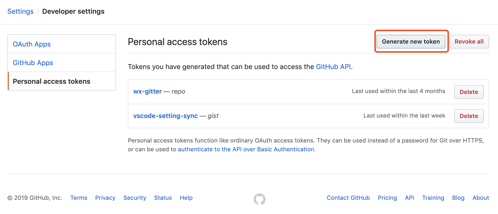
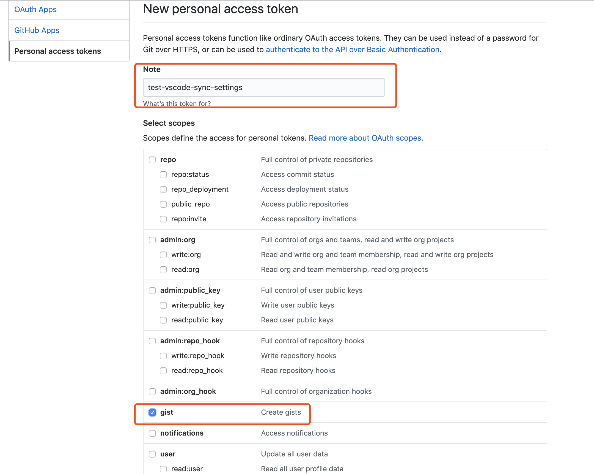
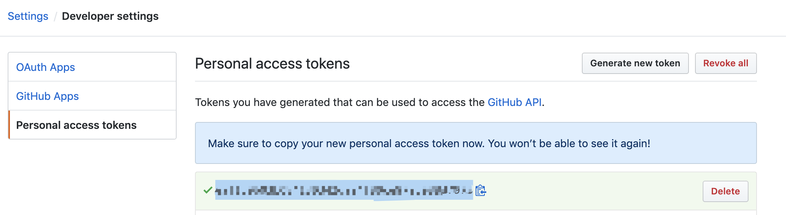
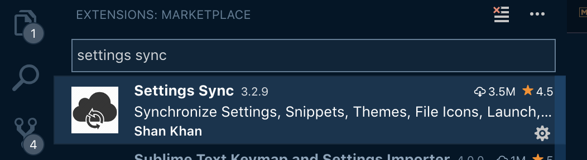
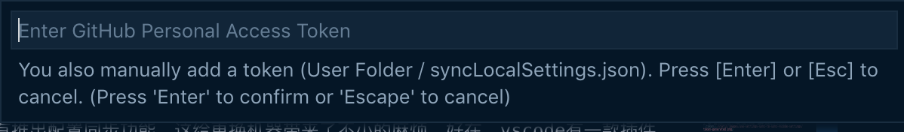
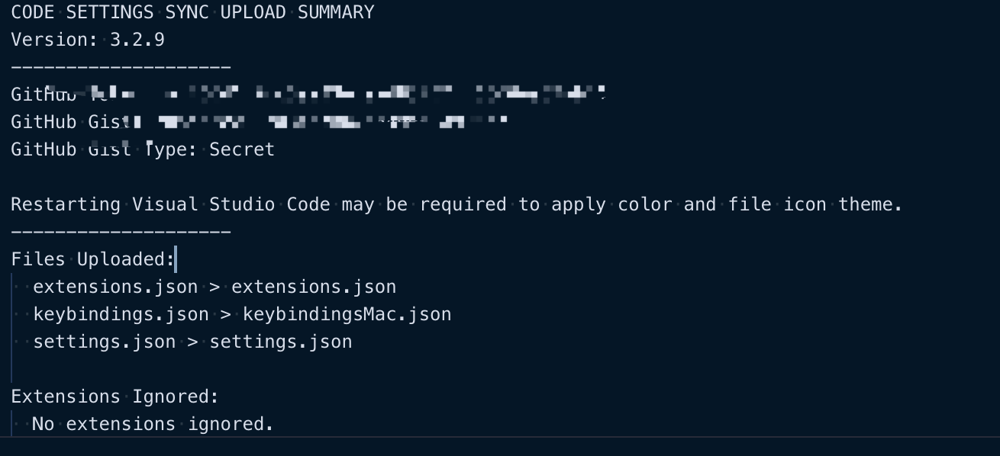
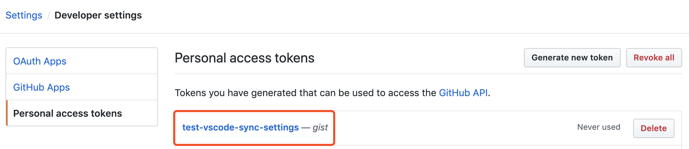
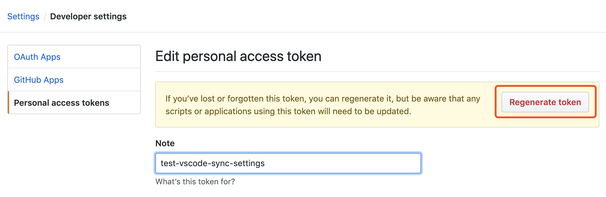

# 使用Settings Sync插件同步VS Code配置
vscode官方没有推出配置同步功能，这给更换机器带来了不小的麻烦。好在，vscode有一款插件[Settings Sync](https://marketplace.visualstudio.com/items?itemName=Shan.code-settings-sync)能够帮我们解决这个问题。它通过github gist来保存vscode的配置信息，使用起来是十分的简单、方便。

## 安装准备
1. Github账号
2. Settings Sync插件

### 配置Github
1. 打开Github主页，进入Settings -> Developer settings -> Personal access tokens页面，点击Generate new token，如下图：

2. 输入任意帮助记忆的note，并（只）勾选gist权限，如下图：

3. 创建好token之后，注意记录下刚才生成的token，如下图：


### 配置Settings Sync
1. 在应用商店里搜索并安装Settings Sync插件，如下图：

2. 安装完成之后，敲击"shift+options+u"开始同步配置（windows的快捷键为：shift+alt+u），如果是第一次运行此命令，请在弹窗中输入之前生成的token

3. 配置同步完毕，如下图：


## 基本使用
### 上传配置
快捷键：
```
mac:
shift+options+u

win：
shift+alt+u
```
### 下载配置
快捷键：
```
mac:
shift+options+d

win:
shift+alt+d
```

## 忘记token
更换机器时，如果忘记了token，可以通过如下步骤恢复：

1. 在github上查看token信息，如下图：

2. 选择Regenerate token，如下图：

3. 重复上文中输入token的步骤即可

